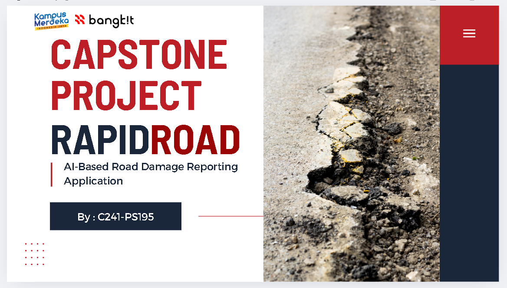

# 🐟 Water Quality Determination System for Koi Fish (IoT + Decision Tree)
You can view the full project source code here:  
👉 [https://github.com/morimana-cuk/flask_decision_tree_air_kolam_koi](https://github.com/morimana-cuk/flask_decision_tree_air_kolam_koi) 
👉 [https://github.com/morimana-cuk/web_koi](https://github.com/morimana-cuk/web_koi)

**Year:** 2025  
**Role:** Backend Developer  
**Tech Stack:** Python, Flask, MySQL, Decision Tree, IoT Sensors, Laravel, PHP  

---

### 🌊 Overview
Sistem ini digunakan untuk menentukan kualitas air pada kolam ikan koi berdasarkan data sensor IoT (pH, suhu, kekeruhan).  
Sistem akan mengklasifikasikan kondisi air menjadi **Baik**, **Sedang**, atau **Buruk** dengan menggunakan algoritma **Decision Tree**.

---

### 🧠 Responsibilities
- Mengembangkan backend API menggunakan Flask untuk komunikasi data sensor ke server.  
- Mengimplementasikan **algoritma Decision Tree** untuk klasifikasi kualitas air.  
- Mengintegrasikan hasil pembacaan sensor IoT ke dashboard web untuk monitoring dan visualisasi.  
- Melakukan pengujian model dan evaluasi akurasi menggunakan dataset hasil pembacaan sensor lapangan.

---

<!-- ### ⚙️ Technical Challenges & Solutions
- **Masalah:** Delay data dari sensor menyebabkan hasil klasifikasi tidak sinkron.  
  **Solusi:** Menambahkan mekanisme *data buffering* di server dan *timestamp validation* sebelum klasifikasi dijalankan.  
- **Masalah:** Akurasi model tidak konsisten di awal.  
  **Solusi:** Melakukan *data normalization* dan *retraining* dengan dataset lebih representatif.

--- -->

### 📊 Results
- Sistem mampu menampilkan status kualitas air secara **real-time** dengan tingkat akurasi di atas 90%.  
- Memudahkan pengguna dalam memantau kondisi air dan mencegah kematian ikan akibat kualitas buruk.

---

### 🧰 Tools Used
Python • Flask • MySQL • Scikit-learn • Git • Laravel • PHP

---

### 📚 Reference
This project was developed as part of my undergraduate thesis at Politeknik Negeri Jember (2025).  
📄 [Download Thesis (PDF)](../documents/Skripsi%20Rizal-%20Revisi%20Sidang%20sudah%20acc.pdf)

---

### 🖼️ Screenshots

<!--  -->
<!-- 
*Dashboard view showing AI-based damage classification results.*

*API testing during development.* -->

---

### 🎥 Video

<!-- (https://youtu.be/GLpPmcg6FLo?si=elMusrpdzC1RUUqZ) -->
<!-- 
*Click the thumbnail or [watch it directly here](https://www.youtube.com/watch?v=YOUR_VIDEO_ID).* -->
