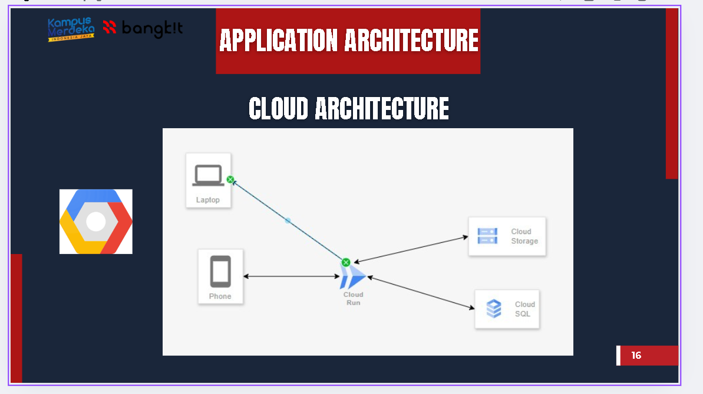

# 🎓 SI MBKM — Web Application for MBKM Student Data Management
<!-- You can view the full project source code here:  
👉 [Maaf ini project internal tidak boleh di sebar]() -->

**Year:** 2023  
**Role:** Backend Developer  
**Tech Stack:** Laravel, PHP, MySQL  

---

### 🧩 Overview
SI MBKM (Sistem Informasi MBKM) adalah aplikasi untuk mencatat, memverifikasi, dan mengelola data mahasiswa peserta program Merdeka Belajar Kampus Merdeka di Politeknik Negeri Jember.

---

### 🧠 Responsibilities
- Mengembangkan fitur **konfirmasi nilai**, **validasi data**, dan **kelola mahasiswa** menggunakan Laravel.  
- Membuat modul laporan dan ekspor data untuk keperluan akademik.  
- Menjamin keamanan input melalui sistem validasi berlapis.

---

<!-- ### ⚙️ Technical Challenges & Solutions
- **Masalah:** Data nilai sering tidak sinkron antar dosen pembimbing.  
  **Solusi:** Membuat modul verifikasi dua tahap dengan status persetujuan.  
- **Masalah:** Akses antar prodi tidak terkontrol.  
  **Solusi:** Menerapkan sistem otorisasi berdasarkan role dan prodi.

--- -->

### 📊 Results
- Proses validasi nilai mahasiswa menjadi lebih cepat dan akurat.  

---

### 🧰 Tools Used
Laravel • MySQL • Git • Postman

---

### 🖼️ Screenshots

<!--  -->
<!-- 
*Dashboard view showing AI-based damage classification results.*

*API testing during development.* -->

---

### 🎥 Video

<!-- (https://youtu.be/GLpPmcg6FLo?si=elMusrpdzC1RUUqZ) -->
<!-- 
*Click the thumbnail or [watch it directly here](https://www.youtube.com/watch?v=YOUR_VIDEO_ID).* -->

