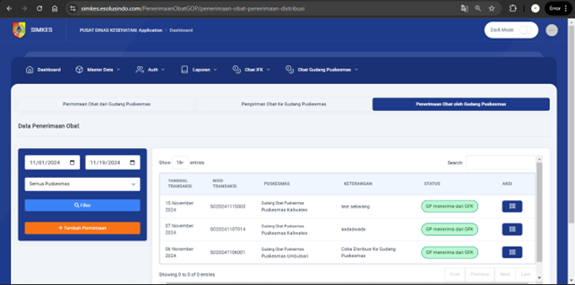

# 💊 SIMKES — Medicine Procurement Management System
You can view the full project source code here:  
👉 [Maaf ini project internal tidak boleh di sebar]()

**Year:** 2024  
**Role:** Web Developer Intern  
**Tech Stack:** CodeIgniter, PHP, MySQL, Bootstrap  

---

### 🧩 Overview
SIMKES adalah aplikasi web untuk mengelola proses permintaan, pengiriman, dan penerimaan obat di lingkungan Puskesmas dan Dinas Kesehatan Kabupaten Jember.

---

### 🧠 Responsibilities
- Mengembangkan modul **Permintaan**, **Pengiriman**, dan **Penerimaan** obat.  
- Membuat sistem **CRUD**, validasi input, dan laporan transaksi.  
- Bekerja dalam tim untuk memastikan seluruh alur distribusi obat berjalan otomatis dan efisien.  
- Berkolaborasi dengan pihak Dinkes untuk memastikan kesesuaian sistem dengan SOP.

---

<!-- ### ⚙️ Technical Challenges & Solutions
- **Masalah:** Banyak user yang input data ganda secara bersamaan.  
  **Solusi:** Menambahkan validasi *unique transaction key* di level database.  
- **Masalah:** Laporan transaksi lambat.  
  **Solusi:** Menggunakan *server-side pagination* dan optimasi query agregat.

--- -->

### 📊 Results
- Penginputan data menjadi lebih cepat dan akurat.  
- Puskesmas dapat memantau status permintaan obat secara real-time.

---

### 🧰 Tools Used
CodeIgniter • MySQL • Bootstrap • jQuery • Git

---

### 🖼️ Screenshots
-
-
-
-
-
-

<!--  -->
<!-- 
*Dashboard view showing AI-based damage classification results.*

*API testing during development.* -->

---

### 🎥 Video
<!-- (https://youtu.be/GLpPmcg6FLo?si=elMusrpdzC1RUUqZ) -->
<!-- 
*Click the thumbnail or [watch it directly here](https://www.youtube.com/watch?v=YOUR_VIDEO_ID).* -->
