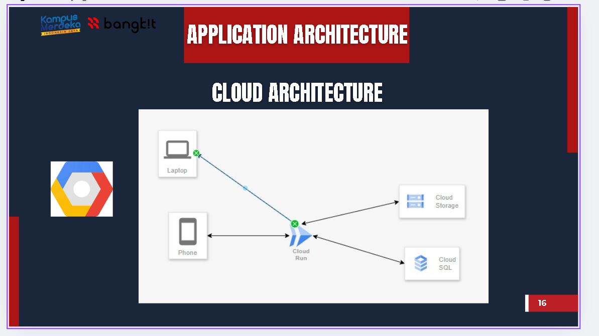

# 🏥 SIMRSGM — Hospital Management Web Application
You can view the full project source code here:  
👉 [Maaf ini project internal tidak boleh di sebar]()

**Year:** 2025  
**Role:** Backend Developer  
**Tech Stack:** Laravel, PHP, MySQL, PostgreSQL, AJAX  

---

### 🧩 Overview
SIMRSGM (Sistem Informasi Manajemen Rumah Sakit Gigi dan Mulut) adalah aplikasi web untuk mengelola berbagai aktivitas operasional di Rumah Sakit Gigi & Mulut Universitas Jember.  
Sistem ini menangani manajemen data klinik, laboratorium, CSSD, dan laundry.

---

### 🧠 Responsibilities
- Mengembangkan modul **Lab Penunjang**, **CSSD**, dan **Laundry** menggunakan Laravel.  
- Melakukan **bug fixing** pada fitur Klinik agar sistem lebih stabil dan cepat.  
- Mendesain ulang query database untuk mengurangi duplikasi data dan mempercepat proses transaksi.  
- Melakukan integrasi antar modul agar data pasien, stok alat, dan hasil lab saling sinkron.

---

<!-- ### ⚙️ Technical Challenges & Solutions
- **Masalah:** Query berat pada modul Klinik membuat load time tinggi.  
  **Solusi:** Optimalisasi indeks dan relasi antar tabel, serta caching hasil query untuk data yang sering diakses.  
- **Masalah:** Inkonsistensi data antar modul.  
  **Solusi:** Menambahkan middleware validasi data di layer service Laravel.

--- -->

### 📊 Results
<!-- - Waktu akses data Klinik turun ±40%.   -->
- Error transaksi antar modul berkurang.  
- Proses sinkronisasi antar departemen rumah sakit jadi otomatis.

---

### 🧰 Tools Used
Laravel • MySQL • PostgreSQL • AJAX • Git

--

### 🖼️ Screenshots
<!--  -->
<!-- 
*Dashboard view showing AI-based damage classification results.*

*API testing during development.* -->

---

### 🎥 Video
<!-- (https://youtu.be/GLpPmcg6FLo?si=elMusrpdzC1RUUqZ) -->
<!-- 
*Click the thumbnail or [watch it directly here](https://www.youtube.com/watch?v=YOUR_VIDEO_ID).* -->
